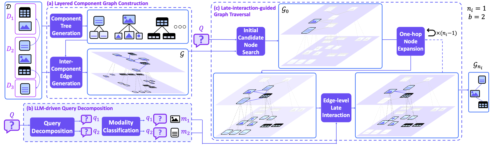

# LILaC: Late Interacting in Layered Component Graph

**Repository for the ARR May Submission: “LILaC: Late Interacting in Layered Component Graph for Open‑domain Multimodal Multihop Retrieval”.**


---



---

## 🗺️ Project Overview

LILaC is a **retrieval‑first framework** for open‑domain question answering over multimodal documents. It introduces two key innovations:

1. **Layered Component Graph** – documents are represented at *two granularities* (paragraph/table/image ↔ sentence/row/object) and are connected by explicit intra‑ & inter‑document edges.
2. **Late‑Interaction Subgraph Retrieval** – a beam‑search traversal that scores candidate edges on‑the‑fly via *subcomponent‑level late interaction*, guided by LLM‑driven query decomposition.

Together, these ideas enable efficient yet accurate multihop reasoning and deliver **state‑of‑the‑art retrieval on 4 / 5 public benchmarks without any task‑specific fine‑tuning**.

---

## ✨ Key Features

* **Layered component graph**: coarse nodes for speed, fine nodes for precision.
* **Plug‑and‑play embedders**: supports *MM‑Embed*, *UniME*, *mmE5*, or any CLIP‑like encoder.
* **LLM‑powered query decomposition** (zero‑shot, works out‑of‑the‑box with Qwen‑2.5 or GPT‑3.5‑turbo).
* **Edge‑wise late interaction** for strong signal without pre‑computing edge embeddings.
* **Reproducible experiments**: scripts reproduce Table 1 & 2 in the paper on MP‑DocVQA, SlideVQA, InfoVQA, MultimodalQA, MMCoQA.

---

## ⚡ Quick Start

### 1. Install core dependencies

```bash
conda create -n lilac python=3.10 -y
conda activate lilac
pip install -r requirements.txt
```

> Tested with **Python 3.10**, **PyTorch 2.2**, and **CUDA 12.2**.

### 2. Download pretrained models

Includes **Qwen‑2.5‑VL‑7B** for multimodal embedding and multimodal generation.

```bash
./Models/download_models.sh
```

### 3. Reproduce MM‑Embed baseline results (one‑liner each)

```bash
/root/LILaC/scripts/experiments/retriever_accuracy.sh
/root/LILaC/scripts/experiments/end_to_end_accuracy.sh
/root/LILaC/scripts/experiments/parameter_sensitivity.sh
```

### 4. Visualise experiment logs

```bash
/root/LILaC/scripts/experiment_visualization/retriever_accuracy.sh
/root/LILaC/scripts/experiment_visualization/end_to_end_accuracy.sh
```

### 5. (Optional) Evaluate **UniME** and **mmE5** embedders

#### 5‑1. Create separate conda environments

```bash
mkdir -p ~/miniconda3
wget https://repo.anaconda.com/miniconda/Miniconda3-latest-Linux-x86_64.sh -O ~/miniconda3/miniconda.sh
bash ~/miniconda3/miniconda.sh -b -u -p ~/miniconda3
rm ~/miniconda3/miniconda.sh

conda create -n unime   python=3.10 -y && pip install -r conda_environments/unime.txt
conda create -n mme5    python=3.10 -y && pip install -r conda_environments/mme5.txt
```

#### 5‑2. Embed documents with the new models

```bash
/root/LILaC/scripts/parse_multimodal_document/step8_embed_unime.sh
/root/LILaC/scripts/parse_multimodal_document/step8_embed_mme5.sh
```

#### 5‑3. Enable the additional models in experiment scripts

Uncomment the **UniME** / **mmE5** lines in:

```
/root/LILaC/scripts/experiments/retriever_accuracy.sh
/root/LILaC/scripts/experiments/parameter_sensitivity.sh
/root/LILaC/scripts/experiments/end_to_end_accuracy.sh
```

then re‑run the scripts above.

---

## 🏗️ Repository Layout

The repository is organised as follows (top‑level directories only):

```
├── src/                   # core Python package (importable as `lilac`)
│   └── top_modules/       # Actual retriever / generator modules
├── config/                # YAML configs for datasets, retriever/generator, experiments
├── scripts/               # end‑to‑end pipelines & helper bash scripts
├── datasets/              # pre‑processed benchmark corpora (auto‑downloadable)
├── algorithm_results/     # Retrieval / QA results produced by experiments
├── Models/                # `download_models.sh` + downloaded checkpoints
├── conda_environments/    # sample environment specs for each embedder
└── src_experiment/        # experiment-related codes
```

### Directory Descriptions

| Directory                 | Purpose                                                                                                                                                                  |
| ------------------------- | ------------------------------------------------------------------------------------------------------------------------------------------------------------------------ |
| **src/**                  | **Production code**. |
| **config/**               | Centralised YAML configurations: dataset metadata, retriever/generator stacks, experiment presets.                                                                       |
| **scripts/**              | Bash helpers that wrap common workflows – building graphs, running retrieval/QA experiments, visualising results. Each sub‑folder corresponds to a pipeline stage.       |
| **datasets/**             | Storage for *parsed* documents, component embeddings, subimages, and ground‑truth Q‑A pairs.                 |
| **algorithm\_results/**   | Auto‑generated by `scripts/experiments/*`. Contains JSON logs of retrieval rankings and end‑to‑end QA outputs. Safe to delete when space is tight.                   |
| **Models/**               | Convenience script to pull required checkpoints (MM‑Embed, UniME, mmE5).here.                                                             |
| **conda\_environments/**  | Ready‑made snapshots for each embedder; handy for reproducible environments.               |
| **src\_experiment/**      | One‑off research utilities |


---


## 🔍 Benchmarks

| Dataset                                                                                    | Domain       | Components / Doc | SOTA (R\@3) |
| ------------------------------------------------------------------------------------------ | ------------ | ---------------- | ----------- |
| MP‑DocVQA                                                                                  | Industrial   | 3                | **83.6 %**  |
| SlideVQA                                                                                   | Slides       | 3                | **92.8 %**  |
| InfoVQA                                                                                    | Infographics | 3                | 86.9 %      |
| MultimodalQA                                                                               | Webpages     | 37               | **69.1 %**  |
| MMCoQA                                                                                     | Webpages     | 32               | **55.8 %**  |

---

## 🧩 Extending LILaC

**Custom embedders**: 
* implement the `BaseEmbedder` interface in `src/embedder/` and register via YAML.
* implement component embedding code, following `/src/multimodal_document_manager/step8_embed_*.py` files
* implement query embedding code, following `src/query_decomposer/queryset_embedder_*.py` files


---

## 🙏 Acknowledgements

This work builds upon open‑source libraries such as PyTorch, FAISS, and HuggingFace Transformers, and incorporates publicly available checkpoints of **MM‑Embed**, **UniME**, and **mmE5**.
